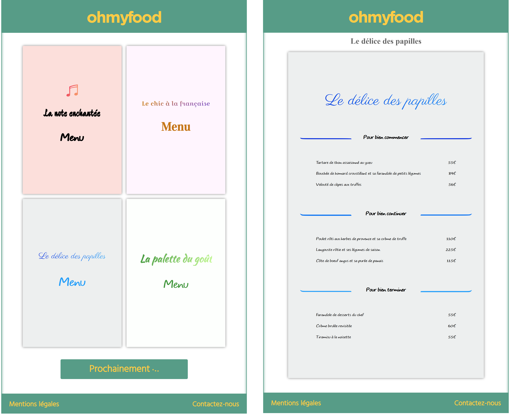

# About this repo :

This was a project for my Junior Web Developper training, consisting in a simple user interface.  
It mainly had to strictly reproduce the model while being perfectly responsive and having the CSS animations requested.  
You can get more details about this project in my portfolio :  
https://portfolio-christophe-bouriel.netlify.app  
By the way, the app has been build and you can find it on Internet :  
https://oriteddy.netlify.app  

Now, to get it working on your computer, follow these steps :

1. Clone this repo :  
`git clone https://github.com/ChristopheBouriel/ohmyfood.git`

2. Enter inside the root folder of the project :  
`cd ohmyfood`

3. Type the command bellow :  
`npm install`

4. Wait for everything to be installed, then type :  
`npm run-script start`

Since I used Yeoman and its workflow which comes with gulp as a task runner, among other things we have a local web server with a fast live reload, and the command above call "gulp serve" to launch this one.  
A new tab will automatically open in your browser, or you can find it at localhost:9000

